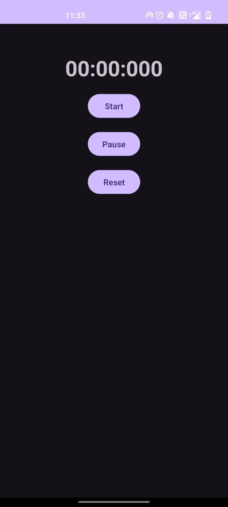
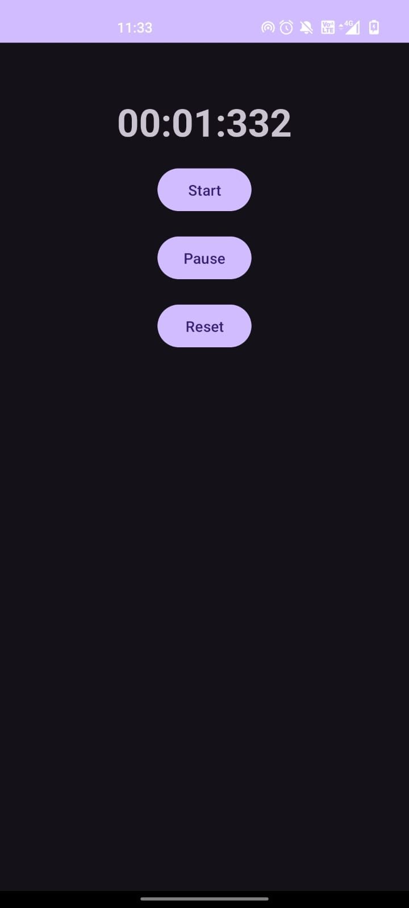

# ⏱️ **Stopwatch App**  
### A Simple and Efficient Stopwatch for Time Tracking  

---

## 📝 **Overview**  
**Stopwatch App** is a fully functional and easy-to-use stopwatch application designed for precise time tracking. This app was developed as part of my **Android Development Internship** at **Prodigy InfoTech**.  

---

## ✨ **Features**  
- ✅ Clean and intuitive user interface for easy time tracking.  
- ✅ Start, pause, and reset functionality.  
- ✅ Displays elapsed time in hours, minutes, seconds, and milliseconds.  
- ✅ Option to reset the stopwatch to zero.  
- ✅ Accurate time measurement for various activities.  

---

## 📸 **Screenshots**  
<p align="center">
    
  
</p>  

---

## 🛠️ **Technologies Used**  
- **IDE**: Android Studio  
- **Language**: Java  
- **UI Design**: XML  

---

## 🚀 **How to Use**  
1. Download and install the app on your Android device.  
2. Open **Stopwatch App**.  
3. Tap the **Start** button to begin timing.  
4. Tap **Pause** to stop the timer, and **Reset** to set it back to zero.  
5. View the elapsed time in hours, minutes, seconds, and milliseconds.  

---

## ⚙️ **Setup Instructions**  
To clone and run this project on your local machine:  

1. Install **Android Studio**.  
2. Clone this repository:  
   ```bash  
   https://github.com/thirusudar03092003/PRODIGY_AD_03.git
